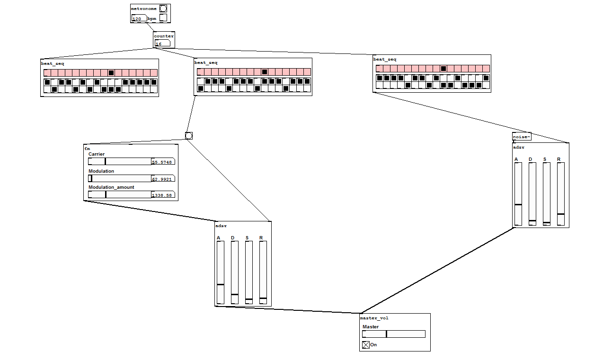

# Puredata

Some subpatches i've created : 

* adsr : simple ASDR control
* beat_seq : Basic beat machine
* counter : count to specified number beginning with 0. Essential when working with sequencers
* distort : Distort input signal
* fm : basic FM generator
* vibrato : 1-20 Hz vibrato
* lowpass : low pass (lop x2)
* metronome : send bang on specified bpm. Also ouputs multipliers greater control on sequencers
* vol : can be piped to other modules
* master_vol : has dac~ output

A patch example 

